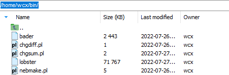
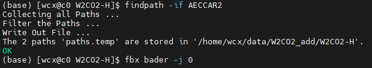
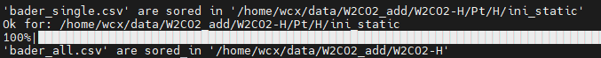

Batch bader in CMD
======================
This is one sample for get bader in batches.

In CMD
----------------------

1. Make sure the necessary software and vasp outputs (Just for First Running).

1.1 Set vasp INCAR to calculate::

    LCHARG = T
    LWAVE = T
    LAECHG= T
    LORBIT= 11

1.2 Make sure necessary_files = ["AECCAR0", "AECCAR2", "CHGCAR", "POTCAR", "CONTCAR"] in each case.

1.3 Install sure necessary_software = ["chgsum.pl", "bader"], and with access permission.

Download: Guide: :doc:`../Guide/command_mode`.

2. Get all sub-path by ``findpath`` command::

    findpath -if AECCAR2

3. Run with fbx (featurebox)::

    fbx bader -j 0

4. Subsequent processing.

    >>> # Ture to python code.
    >>> # More part: The following is not in command model.
    >>> # final treatment to extractor need message and formatting.
    >>> from featurebox.cli.vasp_bader import BaderStartInter, BaderStartSingleResult
    >>> # use  BaderStartInter or BaderStartSingleResult rather than BaderStartZero to escape repetition calculation.
    >>> bsi = BaderStartInter()
    >>> res = pd.read_csv("bader_all.csv")
    >>> features = bsi.extract(res, atoms=[0,1,2,3], format_path=None)
    >>> print(type(result))  # return one formed pd.Dataframe with necessary message.

Traditional python
----------------------

1. Make sure the necessary software and vasp outputs. (Just for First Running).

2. Get all sub-path (optional).

    >>> from mgetool.imports.batchfilematch import BatchFileMatch
    >>> bfm = BatchFileMatch(".")
    >>> bfm.filter_file_name(include="AECCAR2")
    >>> paths_list = bfm.merge()
    >>> paths_list = bfm.get_leaf_dir(paths_list)
    >>> print(paths_list)

3. Run with featurebox.

    >>> from featurebox.cli.vasp_bader import BaderStartZero
    >>> bsz = BaderStartZero(n_jobs=4, tq= True, store_single=True)
    >>> result = bsz.transform(paths_list)
    >>> print(type(result))  # return pd.Dataframe

4. Subsequent processing.

    >>> # More part: The following is not in command model.
    >>> # final treatment to extractor need message and formatting.
    >>> features = bsz.extract(res, atoms=[0,1,2,3],format_path=None)
    >>> print(type(features))  # return one formed pd.Dataframe with necessary message.

