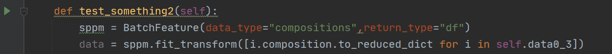

Batch Transform Data
======================

If you don't have a preference or idea for features, just try with ``BatchFeature`` ,
We using features from pymatgen firstly.

- Transform structure list.

>>> from featurebox.featurizers.batch_feature import BatchFeature
>>> bf = BatchFeature(data_type="structures", return_type="df")
>>> data = bf.fit_transform(structure_list)

``structures_list`` is list of ``struceture`` of ``pymatgen``.

.. image:: structures0.gif

- Transform composition list.

>>> from featurebox.featurizers.batch_feature import BatchFeature
>>> bf = BatchFeature(data_type="compositions")
>>> com = [[{str(i.symbol): 1} for i in structurei.species]  for structurei in structure_list]
>>> #where com is element list
>>> data = bf.fit_transform(com)

- Transform element list.

>>> from featurebox.featurizers.batch_feature import BatchFeature
>>> bf = BatchFeature(data_type="elements")
>>> aas = [[{str(i.symbol): 1} for i in structurei.species]  for structurei in structure_list]
>>> data = bf.fit_transform(aas)
>>> bf.element_c.search_tp="number"
>>> aas = [[i.specie.Z for i in structure] for structure in structure_list]
>>> data = bf.fit_transform(aas)

Note
::

    It is highly recommended that using this function as a beginner,
    Because we can customize more and more powerful converters.

Now, try it !
