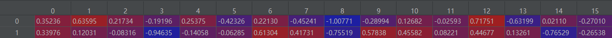
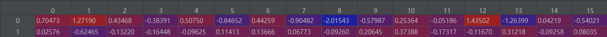
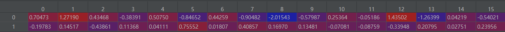

Json Data
==============

The key json must be element name, such as {"H": ... ,"He": ... },
and the structures is pymatgen ``Structure`` list.

- Index by structure.

>>> from featurebox.featurizers.atom.mapper import AtomJsonMap
>>> tmps = AtomJsonMap(search_tp="number", embedding_dict="ele_megnet.json")
>>> a = tmps.convert(structurei)

The return data are properties of 1, 76 elements.

- Index by number, with your-self json.

>>> from featurebox.featurizers.atom.mapper import AtomJsonMap
>>> tmps = AtomJsonMap(search_tp="number",embedding_dict="ele_megnet.json")
>>> s = [1,76]
>>> a = tmps.convert(s)

The return data are properties of 1, 76 elements.

- Index by dict data.

>>> from featurebox.featurizers.atom.mapper import AtomJsonMap
>>> tmps = AtomJsonMap(search_tp="name")
>>> s = [{"H": 2, }, {"Al": 1}] # or [{i.element.symbol:1} for i in structure.species]
>>> a = tmps.convert(s)

- Batch data.

>>> from featurebox.featurizers.atom.mapper import AtomJsonMap
>>> tmps = AtomJsonMap(search_tp="name")
>>> s = [[{"H": 2, }, {"Ce": 1}],[{"H": 2, }, {"Al": 1}]]
>>> a = tmps.transform(s)

The return data are list of 2 np.ndarray data.

