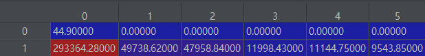

Table data
================

Read table data as following format, and organize by composition.

===== ===== ===== =====
Data    F0    F1    ...
----- ----- ----- -----
H     V     V     ...
He    V     V     ...
Li    V     V     ...
Be    V     V     ...
...   ...   ...   ...
===== ===== ===== =====

- Then run the code.

>>> from featurebox.featurizers.atom.mapper import AtomTableMap
>>> tmps = AtomTableMap(search_tp="name",tablename=your_pd_dataframe)
>>> com = [{"H": 2, }, {"Po": 1}, {"C": 2}]
>>> a = tmps.convert(com)

- In default, the proportion would be multiplied in data, also you can neglect weight.

>>> tmps = AtomTableMap(search_tp="name", weight=False, tablename=your_pd_dataframe)
>>> com = [{"H": 2, }, {"Po": 1}, {"C": 2}]
>>> a2 = tmps.convert(com)

.. image:: 2_2.png

- Index by structure

>>> tmps = AtomTableMap(search_tp="number",tablename="oe.csv")
>>> a = tmps.convert(structure)

Note
::

>>> com = [i.species.as_dict() for i in structure.sites]

or

>>> com =  [{str(i.symbol): 1} for i in structure.species]