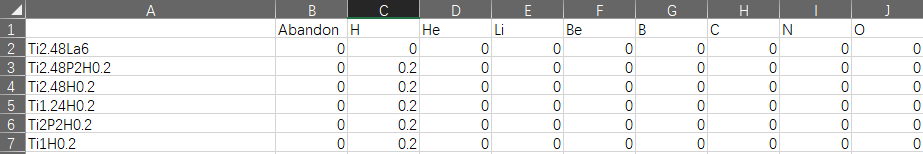

Name Split
==========================

Split complex str compound name to data.
::

>>> from featurebox.data.namesplit import NameSplit
>>> import os
>>> os.chdir(r'.')
>>> name = ['(Ti1.24La3)2',"((Ti1.24)2P2)1H0.2", "((Ti1.24)2)1H0.2", "((Ti1.24))1H0.2", "((Ti)2P2)1H0.2",  "((Ti))1H0.2"]
>>> NSp = NameSplit()
>>> NSp.transform(name)

In local disk, there are 2 csv file.

.. image:: 5_2.png
