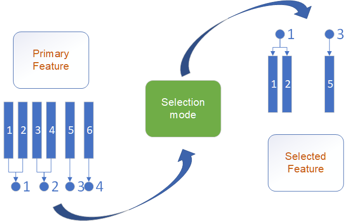

Binding Selection
==================

For material problems, some features may need to appear together to make sense.
such as the hole radius and atomic radius of inner atoms.

Or we use the depart element features to model the composition properties directly.
rather than combine element features, and filter.
such as A-site properties and B-site properties in AB2-type compound should be selected and dropped simultaneously.

All the selection method of featurebox are with ``Binding``,
of course, if without setting any bindings, they can degenerate to normal algorithms.

Example:

>>> from sklearn.datasets import load_boston
>>> from sklearn.svm import SVR
>>> from featurebox.selection.backforward import BackForward
>>> X,y = load_boston(return_X_y=True)
>>> svr= SVR()
>>> bf = BackForward(svr, random_state=1, multi_index=[0,8], multi_grade=2)
>>> new_x = bf.fit_transform(X,y)
>>> bf.support_

The ``multi_index`` parameter means the bonded primary feature index.

All the selection tools are ``sklearn-type``, with ``fit``, ``fit_transform`` methods .etc.

More:

:class:`featurebox.selection.backforward.BackForward`

:class:`featurebox.selection.corr.Corr`

:class:`featurebox.selection.exhaustion.Exhaustion`

:class:`featurebox.selection.ga.GA`

