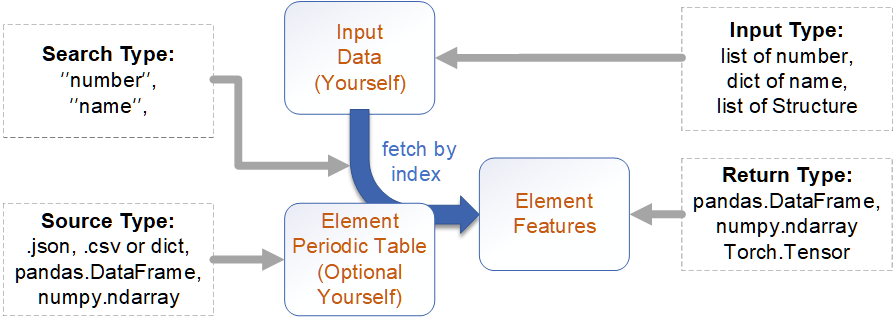
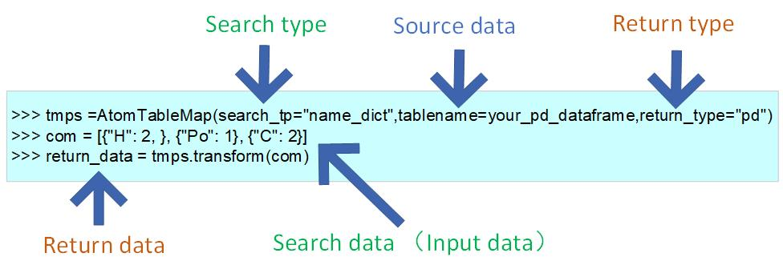

Data Type for Generation
=========================

Before reading this part,
make sure the you have already known ``Structure`` from :doc:`background`.

Definition
---------------

We divided the features into the following categories:

1. **atom/element feature** *

    The properties of atoms/elements themselves.

2. **bond features**

    The properties of inter-atomic bonds.

3. **state (overall compound) features** *

    The overall properties of the compound, include the properties that embody the overall crystal structure.

4. **crystal structure features (graph features)**

    The total of atom/element feature, bond features, state (overall compound) features.

.. note::

    Different from 1,3, The 2,4 is cannot be used directly for ``sklearn``, but suit for ``torch`` .

Access
---------
All the **Generation** tools with  ``convert`` method for single case,
and ``fit_transform`` methods for case list.

1. Atom/Element Features
:::::::::::::::::::::::::

Example Graph 1:

Example Graph 2:

Atom/Element features can be obtained by fetching periodic table data, using you input data.
There are two data should offer. (at least one).

- Your input data. The type could be atom number ( ``list`` ) or element name ( ``dict`` ) or pymatgen ``Structure``.
    (we have built-in conversion functions of ``Structure``,
    to directly get all the atomic information in compound).

- The element periodic table data (optional).
    We have built-in some element periodic table ("ele_table.csv", "ie.json", "oe.csv"),
    To customize your element periodic table. you can offer ( ``.json`` , ``.csv`` ) file or
    any python data ( ``dict`` , ``pandas.DataFrame`` , ``numpy.ndarray`` ) in code.

    1. ( ``.json`` , ``dict`` ) by ``AtomJsonMap`` ,

    2. (``.csv``, ``pandas.DataFrame`` , ``numpy.ndarray`` ) by ``AtomTableMap`` .

    3. And one specialized ``AtomPymatgenPropMap`` for fetch data from "pymatgen.core.periodic_table.json".

Example:

**Input atom list**

>>> from featurebox.featurizers.atom.mapper import AtomTableMap
>>> tmps = AtomTableMap(search_tp="number")
>>> single_sample = [1,1,1,76,76]
>>> multi_sample = [[1,1,1,76,76],[3,3,4,4]]
>>> a = tmps.convert(single_sample)
>>> b = tmps.transform(multi_sample)

**Input element dict**

>>> from featurebox.featurizers.atom.mapper import AtomJsonMap
>>> tmps = AtomJsonMap(search_tp="name",return_type="np")
>>> single_sample = [{"H": 2}, {"Po": 1}]
>>> single_sample2 = {"H": 2, "Po": 1}
>>> multi_sample = [[{"H": 2}, {"Po": 1}],  [{"He": 3}, {"P": 4}]] # or
>>> multi_sample2 = [{"H": 2, "Po": 1},  {"He": 3, "P": 4}]
>>> a = tmps.convert(single_sample)
>>> a = tmps.convert(single_sample2)
>>> b = tmps.transform(multi_sample)
>>> b = tmps.transform(multi_sample2)

**Input structure type**

>>> from featurebox.featurizers.atom.mapper import AtomJsonMap
>>> tmps = AtomJsonMap(search_tp="name",return_type="np")
>>> a = tmps.convert(structurei)
>>> b = tmps.transform(structure_list)

More:
    :doc:`../Examples/sample_fea1`

2. Bond Features
:::::::::::::::::

1. For bond features, use the structure data to extract information.
The common structure data include the ``Structure`` of ``Pymatgen``, the ``Atoms`` of ``ase``, etc.
The ``Structure`` and ``Atoms`` could mutual transform by ``pymatgen.io.ase.AseAtomsAdaptor``.

3. State (overall compound) Features
::::::::::::::::::::::::::::::::::::::::::::

There are two method to get state (overall compound) features.

- **1. Information extraction from structure data.**

Example:

>>> from pymatgen.core.structure import Structure
>>> structurei = Structure.from_file(r"your_path/featurebox/data/temp_test_structure/W2C.cif")

>>> from featurebox.featurizers.state.state_mapper import StructurePymatgenPropMap
>>> tmps = StructurePymatgenPropMap(prop_name = ["density", "volume", "ntypesp"])
>>> a = tmps.convert(structurei)
>>> b = tmps.transform([structurei]*10)

where the prop_name is the name of properties of in ``pymatgen`` ,
the name of properties is not apply for all compounds, and the data could not a single number.::

    prop_name = ["atomic_radius","atomic_mass","number","max_oxidation_state","min_oxidation_state",
    "row","group","atomic_radius_calculated","mendeleev_no","critical_temperature","density_of_solid",
    "average_ionic_radius","average_cationic_radius","average_anionic_radius",]

- **2. Combination or mathematical processing of atomic features according to composition ratio.**

This is one key method to get state features!!! We can get the results directly or in two step as needed.

- Get State features directly.

>>> from pymatgen.core.structure import Structure
>>> from featurebox.featurizers.state.statistics import WeightedAverage
>>> structurei =Structure.from_file(r"your_path/featurebox/data/W2C.cif")

>>> from featurebox.featurizers.atom.mapper import AtomTableMap
>>> data_map = AtomTableMap(search_tp="name", n_jobs=1)
>>> wa = WeightedAverage(data_map, n_jobs=1,return_type="df")
>>> x3 = [{"H": 2, "Pd": 1},{"He":1,"Al":4}]
>>> wa.fit_transform(x3)
>>> x4 = [structurei]*5
>>> wa.fit_transform(x4)

More combination operation ``WeightedSum`` , ``GeometricMean`` , ``HarmonicMean`` , ``WeightedVariance``
and so on can be found in :mod:`featurebox.featurizers.state.statistics`. More: :doc:`../Examples/sample_fea3`.

- Get State features by step (Just for compositions with same number of atomic types).

Get the depart element feature first.

>>> from featurebox.featurizers.atom.mapper import AtomJsonMap
>>> from featurebox.featurizers.state.union import UnionFeature
>>> from featurebox.featurizers.state.statistics import DepartElementFeature
>>> data_map = AtomJsonMap(search_tp="name",embedding_dict="ele_megnet.json", n_jobs=1) # keep this n_jobs=1 and return_type="np"
>>> wa = DepartElementFeature(data_map,n_composition=2, n_jobs=1, return_type="pd")
>>> comp = [{"H": 2, "Pd": 1},{"He":1, "Al":4}]
>>> wa.set_feature_labels(["fea_{}".format(_) for _ in range(16)]) # 16 this the feature number of built-in "ele_megnet.json"
>>> couple_data = wa.fit_transform(comp)

Union the depart element feature.

>>> # couple_data is the pd.Dataframe table.
>>> # comp is the atomic ratio of composition.
>>> uf = UnionFeature(comp,couple_data,couple=2,stats=("mean","maximum"))
>>> state_data = uf.fit_transform()

.. note::

    The ``UnionFeature`` also could be used for your own table data!

Addition:
    There one state features transformer to get Polynomial extension for table.

>>> import numpy as np
>>> from featurebox.featurizers.state.union import PolyFeature
>>> state_features = np.array([[0,1,2,3,4,5],[0.422068,0.360958,0.201433,-0.459164,-0.064783,-0.250939]]).T
>>> state_features = pd.DataFrame(state_features,columns=["f1","f2"],index= ["x0","x1","x2","x3","x4","x5"])
>>> pf = PolyFeature(degree=[1,2])
>>> pf.fit_transform(state_features)

More:
    :doc:`../Examples/sample_fea4`, :doc:`../Examples/sample_fea5`.

