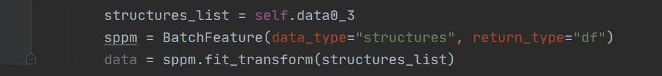

Welcome to featurebox's documentation!
=======================================

.. toctree::
   :hidden:
   :maxdepth: 2
   :caption: Contents:

   Introduction
   Install
   Guide/index
   src/modules
   Examples/index
   contact

.. image:: img.jpg

Featurebox is an open Python library that implements a comprehensive set of machine learning tools for materials informatics,
and aims to generate material features quickly and easily.

Features:
>>>>>>>>>

1. Large batch features production.

2. Selection tools with feature binding and restriction.

3. Match with ``scikit-learn`` and ``torch``.

Links
>>>>>>>

`Github <https://github.com/boliqq07/featurebox>`_  |  `English Version <https://featurebox.readthedocs.io/en/latest/>`_  |  `Chinese Version <https://featurebox.readthedocs.io/zh_CN/latest/>`_

Index
>>>>>>>

* :ref:`genindex`
* :ref:`modindex`

Support
>>>>>>>>

.. image:: jetbrains.svg
    :scale: 40 %
